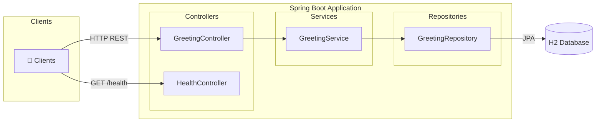
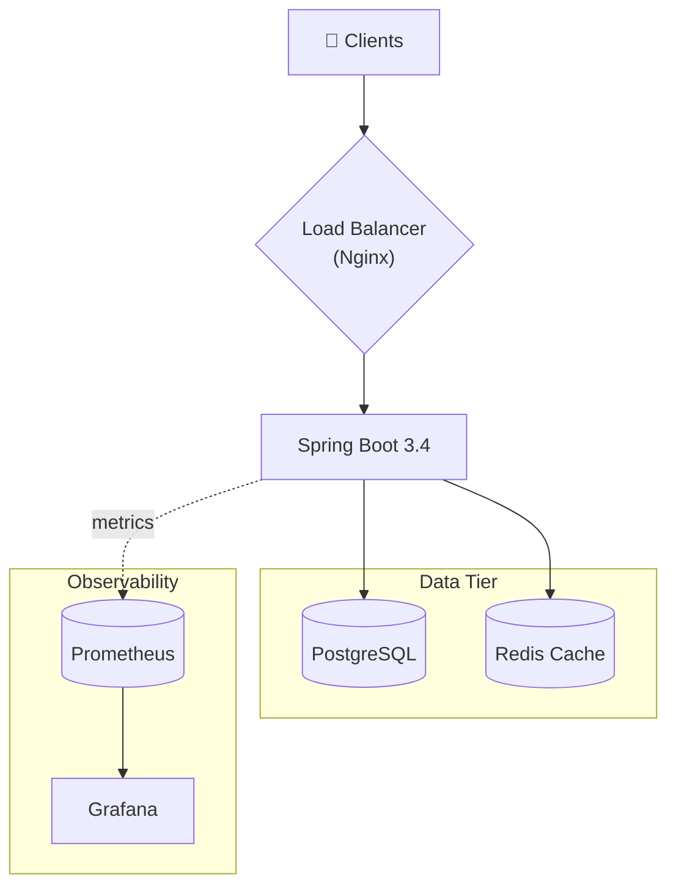
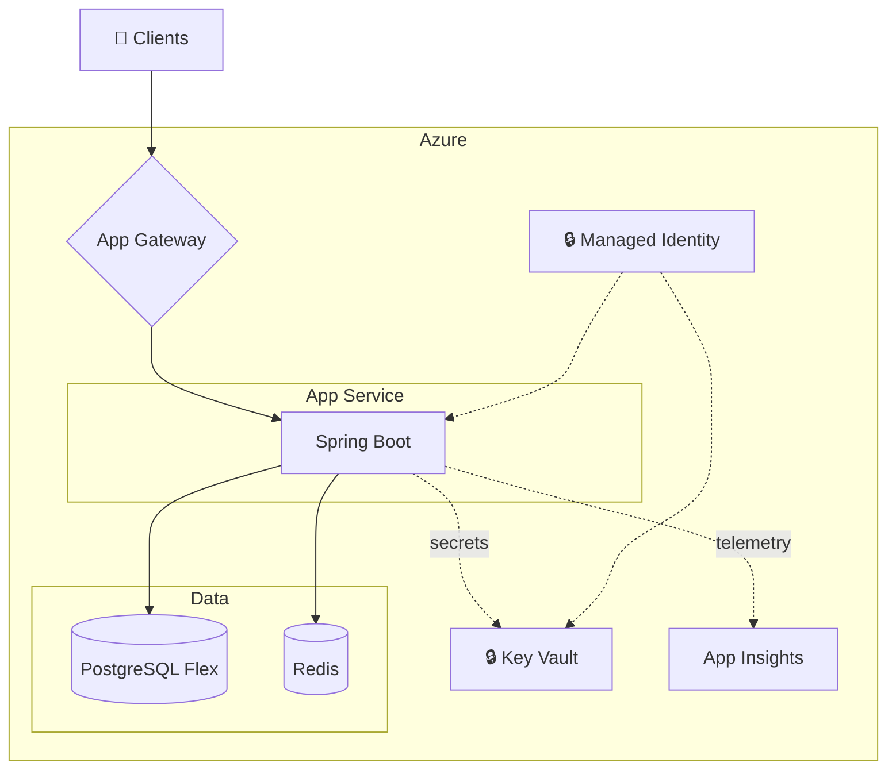
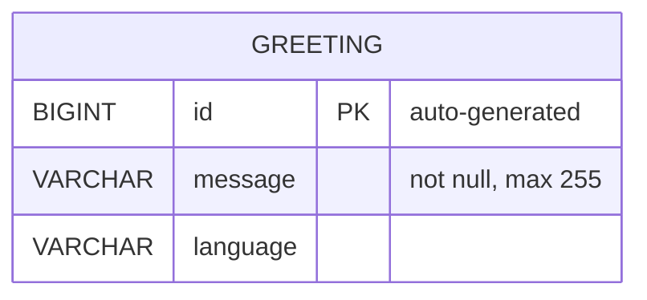
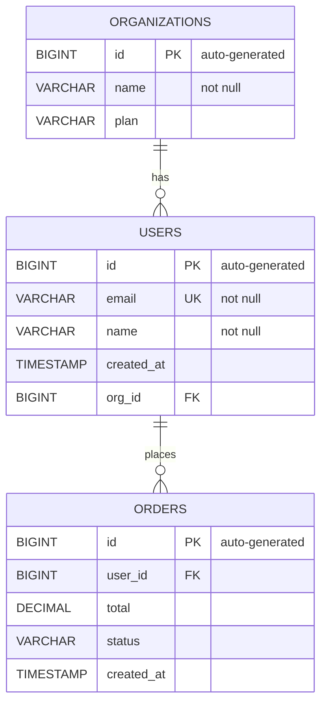
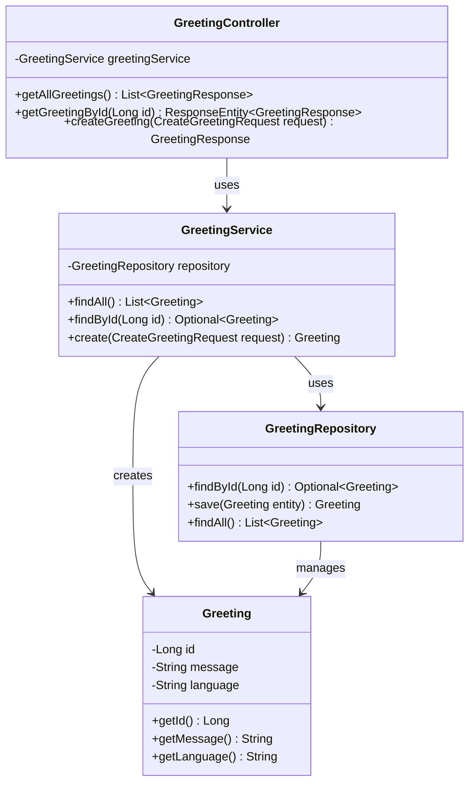
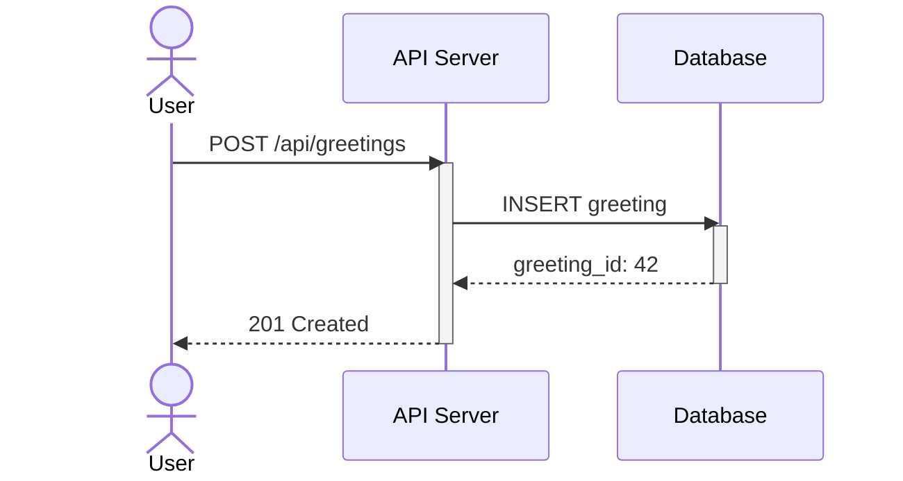
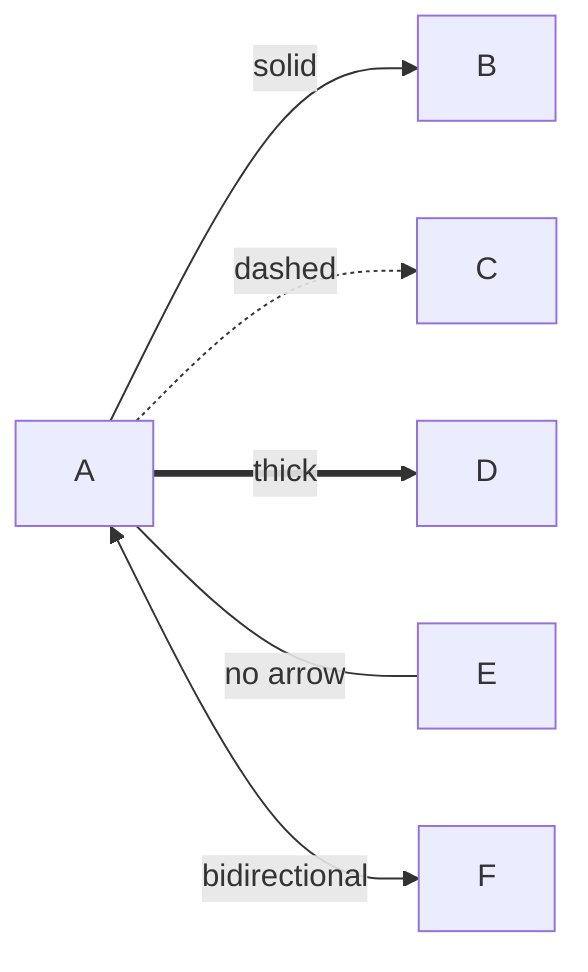
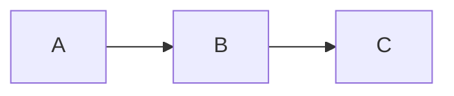

# Diagramming Skill — Spring Boot Edition (Mermaid)

Generate professional SVG/PNG diagrams from a Spring Boot codebase using **Mermaid**.
Zero global installs — just `npx`. Diagrams also render natively in GitHub markdown.

## Prerequisites

Only `npx` (comes with Node.js). Nothing else.

## Rendering Commands

```bash
# Render a single file to SVG (zero-install, auto-downloads on first run)
npx --yes @mermaid-js/mermaid-cli -i docs/diagrams/architecture.mmd -o docs/diagrams/architecture.svg -q

# Render to PNG
npx --yes @mermaid-js/mermaid-cli -i docs/diagrams/erd.mmd -o docs/diagrams/erd.png -q

# Render all .mmd files in a directory
for f in docs/diagrams/*.mmd; do npx --yes @mermaid-js/mermaid-cli -i "$f" -o "${f%.mmd}.svg" -q; done

# With theme (default | forest | dark | neutral)
npx --yes @mermaid-js/mermaid-cli -i docs/diagrams/architecture.mmd -o docs/diagrams/architecture.svg -t dark -q

# With transparent background
npx --yes @mermaid-js/mermaid-cli -i docs/diagrams/architecture.mmd -o docs/diagrams/architecture.svg -b transparent -q
```

## 1. Architecture Diagram Patterns

### Spring Boot 3-Tier (Controller → Service → Repository)



### With Additional Infrastructure



### Azure Deployment Architecture



## 2. JPA ERD Generation

### ERD with `erDiagram`

Mermaid has a built-in `erDiagram` type with columns, types, keys, and relationship cardinality.



### Multi-Entity ERD with Relationships



### Relationship Cardinality Syntax

```
||--||   exactly one to exactly one
||--o{   exactly one to zero or more
}o--o{   zero or more to zero or more
||--|{   exactly one to one or more
```

### JPA Annotation Mapping

When scanning Java `@Entity` classes, map annotations to Mermaid `erDiagram` elements:

| JPA Annotation            | Mermaid ERD Element                   |
| ------------------------- | ------------------------------------- |
| `@Id`                     | `PK` marker after type                |
| `@GeneratedValue`         | `"auto-generated"` comment            |
| `@Column(nullable=false)` | `"not null"` comment                  |
| `@Column(unique=true)`    | `UK` marker after type                |
| `@Column(length=N)`       | `VARCHAR` (length in comment)         |
| `@ManyToOne`              | `FK` marker + `\|\|--o{` relationship |
| `@OneToMany`              | `\|\|--o{` relationship from parent   |
| `@ManyToMany`             | `}o--o{` relationship (via junction)  |
| `@OneToOne`               | `\|\|--\|\|` relationship             |
| `String` field            | `VARCHAR`                             |
| `Long` / `Integer`        | `BIGINT` / `INT`                      |
| `LocalDateTime`           | `TIMESTAMP`                           |
| `BigDecimal`              | `DECIMAL`                             |
| `Boolean`                 | `BOOLEAN`                             |
| `@Enumerated`             | `VARCHAR` with `"enum"` comment       |

### Example: Scanning the Greeting Entity

Given `model/Greeting.java`:

```java
@Entity
@Table(name = "greetings")
public class Greeting {
    @Id @GeneratedValue(strategy = GenerationType.IDENTITY)
    private Long id;
    @NotBlank @Size(max = 255)
    private String message;
    private String language;
}
```

Produces this `.mmd` file:


## 3. UML Class Diagrams



### Visibility Modifiers

```
+   public
-   private
#   protected
~   package/internal
```

## 4. Sequence Diagrams



### Arrow Types

```
->>     solid with arrowhead (sync call)
-->>    dashed with arrowhead (response)
-)      async message (open arrow)
-x      lost message (cross)
```

## 5. Connection & Edge Styling



### Connection Types

| Syntax | Description    | Use For                     |
| ------ | -------------- | --------------------------- |
| `-->`  | Solid arrow    | Data flow, dependencies     |
| `-.->` | Dashed arrow   | Async, monitoring, optional |
| `==>`  | Thick arrow    | Primary/critical path       |
| `---`  | Solid no arrow | Association                 |
| `<-->` | Bidirectional  | WebSocket, sync             |
| `--x`  | Cross end      | Blocked/failed              |

## 6. Node Shapes Quick Reference

| Syntax              | Shape         | Use For                     |
| ------------------- | ------------- | --------------------------- |
| `["text"]`          | Rectangle     | Services, components        |
| `[("text")]`        | Cylinder      | Databases, storage          |
| `{"text"}`          | Diamond       | Decision, load balancer     |
| `(["text"])`        | Stadium       | Start/end                   |
| `(("text"))`        | Circle        | Simple node                 |
| `[/"text"/]`        | Parallelogram | Input/output                |
| `>"text"]`          | Flag          | Events                      |
| `{{"text"}}`        | Hexagon       | Background jobs, processors |
| `["text<br/>more"]` | Multi-line    | Long descriptions           |

## 7. Themes

Available via CLI `--theme` flag:

| Theme     | Description               |
| --------- | ------------------------- |
| `default` | Blue/grey — good for docs |
| `forest`  | Green — nature palette    |
| `dark`    | Dark background           |
| `neutral` | Minimal black & white     |

```bash
npx --yes @mermaid-js/mermaid-cli -i input.mmd -o output.svg -t forest -q
```

## 8. GitHub Markdown Integration

Mermaid renders natively in GitHub markdown — no SVG export needed for docs:

````markdown

````

This renders directly in README.md, PR descriptions, issues, and wiki pages.

## 9. File Output Convention

All diagram files go to `docs/diagrams/`:

| File                              | Purpose                     |
| --------------------------------- | --------------------------- |
| `docs/diagrams/architecture.mmd`  | Architecture diagram source |
| `docs/diagrams/architecture.svg`  | Rendered architecture       |
| `docs/diagrams/erd.mmd`           | ERD source                  |
| `docs/diagrams/erd.svg`           | Rendered ERD                |
| `docs/diagrams/class-diagram.mmd` | UML class diagram source    |
| `docs/diagrams/class-diagram.svg` | Rendered class diagram      |

### Render all diagrams

```bash
for f in docs/diagrams/*.mmd; do
  npx --yes @mermaid-js/mermaid-cli -i "$f" -o "${f%.mmd}.svg" -q
done
```

### Why Mermaid

- **True zero-install** — `npx @mermaid-js/mermaid-cli` just works, no brew/pip/go
- **GitHub-native** — renders inline in markdown, PRs, issues, wikis
- **Built-in ERDs** — `erDiagram` with PK/FK/UK markers and relationship cardinality
- **Built-in class diagrams** — `classDiagram` with visibility modifiers
- **Built-in sequence diagrams** — full actor/participant/activation support
- **Themes** — 4 built-in themes via one CLI flag
- **VS Code preview** — renders in markdown preview, no extension needed
- **Widely adopted** — Notion, Confluence, Obsidian, GitLab, and more
