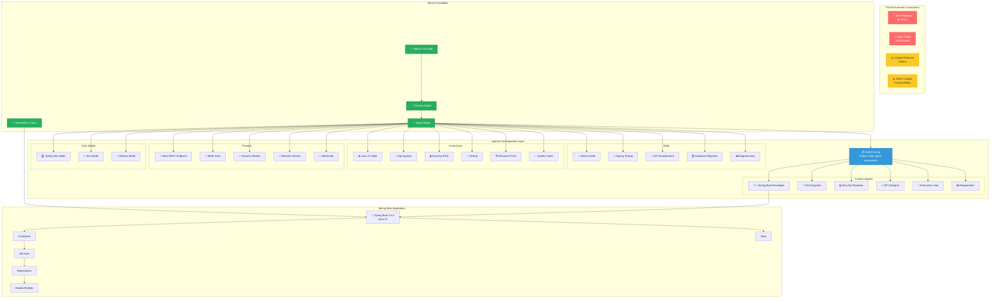
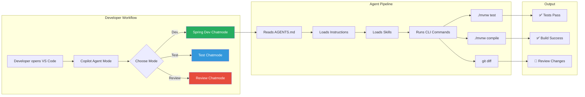
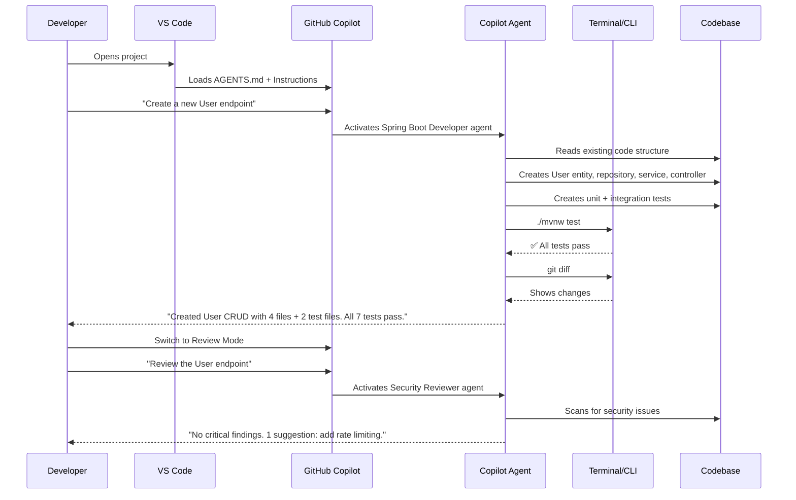
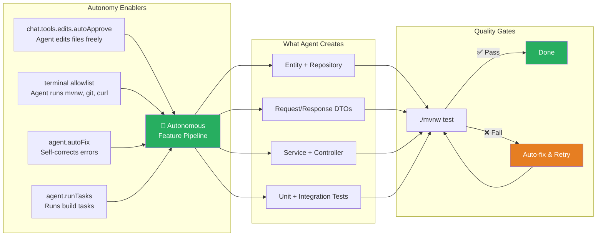
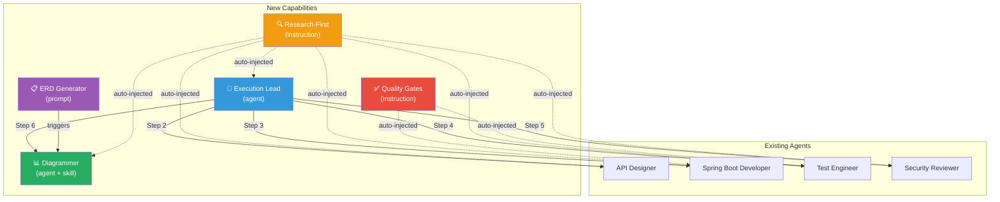

# 🚀 Agentic Spring Boot Starter — FSI Edition

> **Unlock agentic AI-assisted development with GitHub Copilot in restricted Financial Services (FSI) environments — no MCP required.**

This starter project demonstrates how to prepare a Spring Boot application for maximum productivity with GitHub Copilot's Agent Mode, even when MCP (Model Context Protocol) is blocked by organizational policy.

## 🎯 What This Project Solves

In many FSI environments (like Swiss Re), developers face significant restrictions:
- ❌ MCP is blocked by policy
- ❌ Open-source AI tools are not allowed
- ❌ Premium tokens are limited
- ⚠️ WSL2 has incompatibility with Windows Copilot extensions
- ✅ Official VS Code + GitHub Copilot IS available
- ✅ Agent Mode IS enabled

**This starter shows how to maximize agentic development within these constraints** using only built-in VS Code + Copilot features: custom agents, skills, instructions, prompts, chat modes, and terminal tool automation.

## 📊 Architecture Overview



## 🔧 How Agentic Development Works (Without MCP)



## 📁 Project Structure

```
.
├── AGENTS.md                          # 🤖 Main agent instructions (read by ALL agents)
├── README.md                          # 📖 This file
├── pom.xml                            # 📦 Maven build configuration
│
├── .vscode/
│   ├── settings.json                  # ⚙️ Workspace settings (Copilot, Java, terminal tools)
│   └── extensions.json                # 📋 Recommended VS Code extensions
│
├── .github/
│   ├── copilot-instructions.md        # 📋 Project-wide Copilot instructions
│   │
│   ├── agents/                        # 🤖 Custom agent definitions
│   │   ├── spring-boot-developer.md   #    Full-stack Spring Boot developer
│   │   ├── test-engineer.md           #    Testing specialist
│   │   ├── security-reviewer.md       #    FSI security reviewer
│   │   ├── api-designer.md            #    REST API designer
│   │   ├── execution-lead.agent.md    #    🆕 Pipeline orchestrator
│   │   └── diagrammer.agent.md        #    🆕 Architecture & ERD diagrams
│   │
│   ├── instructions/                  # 📝 Context-specific instructions
│   │   ├── java.instructions.md       #    Java 21 coding style
│   │   ├── spring-boot.instructions.md#    Spring Boot patterns
│   │   ├── testing.instructions.md    #    Testing conventions
│   │   ├── security.instructions.md   #    FSI security requirements
│   │   ├── research-first.instructions.md  # 🆕 Research before implementation
│   │   └── quality-gates.instructions.md   # 🆕 Automated quality enforcement
│   │
│   ├── prompts/                       # ⚡ Reusable prompt templates
│   │   ├── new-rest-endpoint.prompt.md#    Create complete REST endpoint
│   │   ├── write-tests.prompt.md      #    Write tests for a class
│   │   ├── security-review.prompt.md  #    Run security audit
│   │   ├── refactor-service.prompt.md #    Refactor a service
│   │   ├── add-entity.prompt.md       #    Add JPA entity
│   │   ├── explain-codebase.prompt.md #    Explain architecture
│   │   ├── generate-erd.prompt.md     #    🆕 Generate JPA ERD diagram
│   │   └── generate-architecture-diagram.prompt.md # 🆕 Architecture diagram
│   │
│   ├── chatmodes/                     # 🎭 Custom chat modes
│   │   ├── spring-dev.chatmode.md     #    Development mode
│   │   ├── test-mode.chatmode.md      #    Testing mode
│   │   └── review-mode.chatmode.md    #    Code review mode
│   │
│   └── skills/                        # 🛠️ Agent skills
│       ├── maven-build/SKILL.md       #    Maven build automation
│       ├── spring-testing/SKILL.md    #    Spring Boot testing
│       ├── api-development/SKILL.md   #    REST API development
│       ├── database-migration/SKILL.md#    Database schema management
│       └── diagramming/SKILL.md       #    🆕 Architecture & ERD diagrams
│
├── docs/diagrams/                     # 📊 Generated diagram output
│   ├── architecture.py                #    Architecture diagram source
│   ├── architecture.png               #    Rendered architecture
│   ├── erd.py                         #    ERD source
│   └── erd.png                        #    Rendered ERD
│
├── docs/                              # 📚 Research & documentation
│   ├── research-notes.md              #    Deep research findings
│   ├── agentic-development-guide.md   #    How-to guide for teams
│   └── fsi-constraints-workarounds.md #    FSI-specific guidance
│
└── src/
    ├── main/
    │   ├── java/com/example/demo/
    │   │   ├── DemoApplication.java
    │   │   ├── controller/
    │   │   ├── service/
    │   │   ├── model/
    │   │   └── repository/
    │   └── resources/
    │       └── application.yml
    └── test/
        ├── java/com/example/demo/
        │   ├── controller/
        │   └── service/
        └── resources/
            └── application.yml
```

## 🚀 Quick Start

### Prerequisites
- Java 21 (LTS)
- VS Code with GitHub Copilot extension
- Git

### Setup
```bash
# Clone the project
git clone <repo-url>
cd agentic-spring-boot-starter

# Build and test
./mvnw clean test

# Run the application
./mvnw spring-boot:run

# Test the API
curl http://localhost:8080/api/health
curl http://localhost:8080/api/greetings
```

### Using Copilot Agent Mode
1. Open the project in VS Code
2. Open Copilot Chat (Ctrl+Shift+I)
3. Switch to **Agent Mode** in the chat dropdown
4. Choose a chat mode:
   - **Spring Dev** — general development
   - **Test Mode** — focused testing
   - **Review Mode** — read-only code review
   - **Full Auto** — maximum autonomy for feature implementation
5. Use slash commands from the prompts: `/implement-feature`, `/new-rest-endpoint`, `/write-tests`, `/security-review`

### Implementing a Feature Autonomously
The killer use case — give the agent a feature spec, it builds everything:

1. Switch to **Full Auto** chat mode
2. Use the `/implement-feature` prompt
3. Describe your feature:
   ```
   /implement-feature

   Create a "Product" feature with these fields:
   - name (required, max 100 chars)
   - description (optional, max 500 chars)
   - price (required, positive decimal)
   - category (required, one of: ELECTRONICS, BOOKS, CLOTHING)
   
   Include full CRUD with search by category.
   ```
4. The agent will autonomously:
   - Create Entity, Repository, DTOs, Service, Controller
   - Write unit + integration tests
   - Run `./mvnw test` to verify
   - Report what it built

## 🛡️ FSI Compliance Features

| Feature | Implementation |
|---------|---------------|
| No hardcoded secrets | Environment variables via `${VAR}` in application.yml |
| Input validation | Bean Validation (`@Valid`, `@NotBlank`, `@Size`) |
| Safe error responses | `@ControllerAdvice` — no stack traces exposed |
| Audit logging | SLF4J structured logging |
| Dependency security | Maven dependency tree analysis |
| Code review | Security Reviewer agent + review chatmode |

## 🔄 The Agentic Workflow



## 📖 VS Code Settings Highlights

The `.vscode/settings.json` is pre-configured for maximum agentic productivity:

| Setting | Purpose |
|---------|---------|
| `chat.agent.enabled` | Enables Agent Mode |
| `chat.tools.terminal.allowlist` | Auto-approves safe Maven/Git/Java commands |
| `chat.tools.terminal.denylist` | Blocks dangerous commands (rm -rf, sudo) |
| `chat.instructionsFilesLocations` | Points to `.github/instructions/` |
| `chat.promptFilesLocations` | Points to `.github/prompts/` |
| `chat.modeFilesLocations` | Points to `.github/chatmodes/` |
| `github.copilot.chat.codeGeneration.useInstructionFiles` | Enables instruction files |

## 🤖 Full Autonomous Feature Implementation

The key innovation: the agent can implement a **complete feature from a spec** without human intervention.

### What Makes This Possible (Without MCP)



### Key Settings That Enable Autonomy

| Setting | Value | What It Does |
|---------|-------|-------------|
| `chat.tools.edits.autoApprove` | `true` | Agent creates/edits files without dialog |
| `chat.agent.autoFix` | `true` | Agent self-corrects compilation errors |
| `chat.agent.runTasks` | `true` | Agent runs VS Code build tasks |
| `chat.agent.maxRequests` | `50` | Allows complex multi-step implementations |
| `terminal.allowlist` | (regex) | Auto-approves `./mvnw`, `git`, `curl` |
| `terminal.denylist` | (patterns) | Blocks dangerous commands |
| `chat.tools.autoApprove` | `false` | ⚠️ Keep false for FSI safety |

### The Pattern The Agent Follows
The `implement-feature` prompt + `feature-pipeline` instruction file teach the agent to follow an exact 10-step pipeline — matching the existing `Greeting` reference implementation. This is critical: **the agent learns by reading your existing code patterns, not just instructions**.

## 📊 New: Diagramming, Orchestration & Quality Gates

Five new capabilities inspired by [petender/tdd-azd-demo-builder](https://github.com/petender/tdd-azd-demo-builder), adapted for Spring Boot / Java 21.

### 1. Diagrammer Agent — Architecture & ERD Diagrams

Automatically generates PNG architecture diagrams and JPA Entity-Relationship Diagrams by scanning your source code.

**How to use:**
```
# In VS Code Copilot Chat, select the "A24 Diagrammer" agent, then:
Generate an architecture diagram for this project

# Or use the prompts:
/generate-erd
/generate-architecture-diagram
```

**What it does:**
- Reads `pom.xml`, `application.yml`, controllers, services, repositories
- Generates Python scripts using the `diagrams` library
- Executes them to produce PNG images in `docs/diagrams/`
- For ERDs: scans `@Entity` classes, extracts fields, relationships, and annotations

**Prerequisites** (installed automatically by the agent):
```bash
pip install diagrams graphviz
brew install graphviz  # macOS
```

**Output:**
| File | Content |
|---|---|
| `docs/diagrams/architecture.py` | Architecture diagram source |
| `docs/diagrams/architecture.png` | Rendered architecture diagram |
| `docs/diagrams/erd.py` | ERD source |
| `docs/diagrams/erd.png` | Rendered Entity-Relationship Diagram |

### 2. Research-First Instruction — Think Before You Code

A global instruction (applied to `**`) that forces ALL agents to research before implementing.

**How it works:**
- Automatically injected into every agent's context
- Requires agents to read existing code, patterns, and conventions before creating files
- Enforces an 80% confidence gate — agents must understand what to build before building it

**No action needed** — this is auto-injected. It improves output quality across all agents.

### 3. Execution Lead — End-to-End Feature Pipeline

An orchestrator agent that builds complete features by delegating to specialized agents in sequence.

**How to use:**
```
# In VS Code Copilot Chat, select "A24 Execution Lead", then describe your feature:

Create a "Product" feature with fields:
- name (required, max 100 chars)
- description (optional, max 500 chars)
- price (required, positive decimal)
- category (enum: ELECTRONICS, BOOKS, CLOTHING)
Include CRUD with search by category.
```

**The pipeline:**
```
Step 1: Requirements    → Execution Lead parses your description
Step 2: API Design      → Delegates to API Designer
Step 3: Implement       → Delegates to Spring Boot Developer
Step 4: Test            → Delegates to Test Engineer
Step 5: Security Review → Delegates to Security Reviewer
Step 6: Diagram         → Delegates to Diagrammer (optional)
```

**Each step produces artifacts the next step reads** — agents communicate through files, not messages.

### 4. JPA ERD Generator — Auto-Document Your Data Model

A dedicated prompt that scans all `@Entity` classes and generates a professional ERD.

**How to use:**
```
/generate-erd
```

**What it extracts from your code:**
| JPA Annotation | ERD Element |
|---|---|
| `@Id` | Primary Key 🔑 |
| `@ManyToOne` | Foreign Key 🔗 + N:1 arrow |
| `@OneToMany` | 1:N relationship arrow |
| `@ManyToMany` | N:M relationship via junction |
| `@Column(nullable=false)` | NOT NULL constraint |
| `@Enumerated` | ENUM type |

### 5. Quality Gates — Automated Enforcement

An instruction (applied to `**/*.java`) that enforces minimum quality standards.

**Gates enforced:**

| Gate | Requirement |
|---|---|
| **Test** | All tests pass, minimum 3 per service + 3 per controller |
| **Build** | Zero compilation errors |
| **Security** | No hardcoded secrets, `@Valid` on all request bodies, no `System.out` |
| **Naming** | Test methods follow `should{Expected}When{Condition}` |
| **Git** | No secrets in diff, conventional commit messages |

**No action needed** — auto-injected for all `.java` files. Agents are blocked from reporting success if any gate fails.

### How These 5 Features Work Together



## 🤝 Contributing

This is a starter template. Customize it for your team:

1. **Modify `AGENTS.md`** to match your project's conventions
2. **Add instructions** for your specific frameworks and libraries
3. **Create prompts** for your team's common tasks
4. **Define agents** for your team's roles
5. **Tune the terminal allowlist** for your build tools

## 📚 Further Reading

- [GitHub Blog: How to write a great AGENTS.md](https://github.blog/ai-and-ml/github-copilot/how-to-write-a-great-agents-md-lessons-from-over-2500-repositories/)
- [VS Code: Custom Agents](https://code.visualstudio.com/docs/copilot/customization/custom-agents)
- [VS Code: Custom Instructions](https://code.visualstudio.com/docs/copilot/customization/custom-instructions)
- [VS Code: Prompt Files](https://code.visualstudio.com/docs/copilot/customization/prompt-files)
- [Agentic DevOps Safe Mode for Secure Copilot Agents](https://arinco.com.au/blog/agentic-devops-safe-mode-a-practical-framework-for-secure-github-copilot-agents/)
- [FSI Agent Governance Framework](https://judeper.github.io/FSI-AgentGov/playbooks/control-implementations/1.1/portal-walkthrough/)

## 📄 License

Internal use — Swiss Re / FSI environments.
