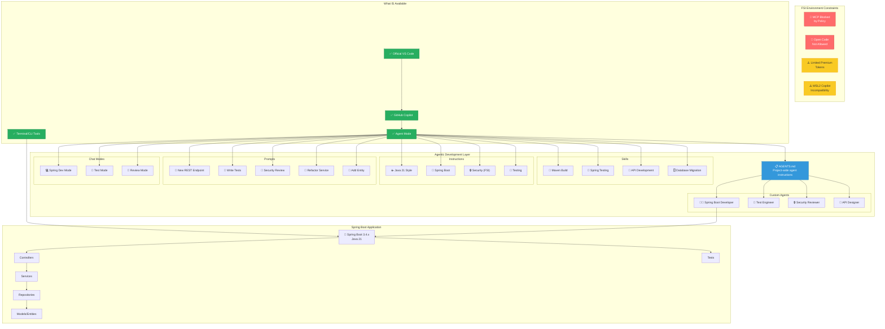
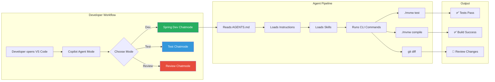
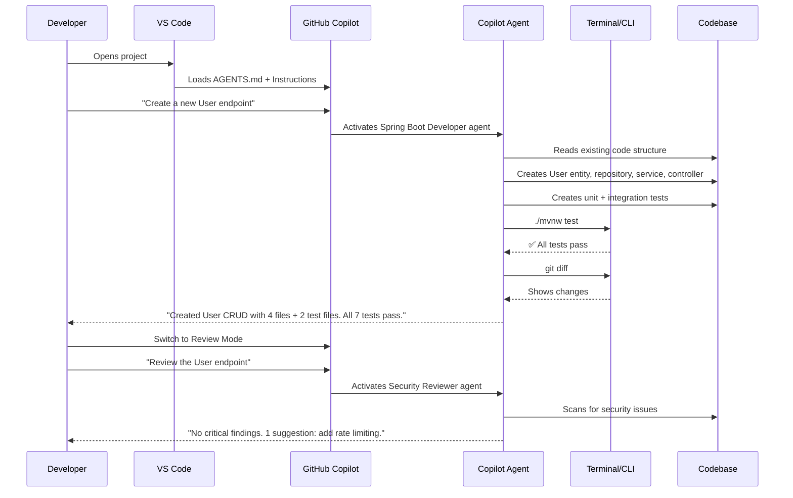

# 🚀 Agentic Spring Boot Starter — FSI Edition

> **Unlock agentic AI-assisted development with GitHub Copilot in restricted Financial Services (FSI) environments — no MCP required.**

This starter project demonstrates how to prepare a Spring Boot application for maximum productivity with GitHub Copilot's Agent Mode, even when MCP (Model Context Protocol) is blocked by organizational policy.

## 🎯 What This Project Solves

In many FSI environments (like Swiss Re), developers face significant restrictions:
- ❌ MCP is blocked by policy
- ❌ Open-source AI tools are not allowed
- ❌ Premium tokens are limited
- ⚠️ WSL2 has incompatibility with Windows Copilot extensions
- ✅ Official VS Code + GitHub Copilot IS available
- ✅ Agent Mode IS enabled

**This starter shows how to maximize agentic development within these constraints** using only built-in VS Code + Copilot features: custom agents, skills, instructions, prompts, chat modes, and terminal tool automation.

## 📊 Architecture Overview



## 🔧 How Agentic Development Works (Without MCP)



## 📁 Project Structure

```
.
├── AGENTS.md                          # 🤖 Main agent instructions (read by ALL agents)
├── README.md                          # 📖 This file
├── pom.xml                            # 📦 Maven build configuration
│
├── .vscode/
│   ├── settings.json                  # ⚙️ Workspace settings (Copilot, Java, terminal tools)
│   └── extensions.json                # 📋 Recommended VS Code extensions
│
├── .github/
│   ├── copilot-instructions.md        # 📋 Project-wide Copilot instructions
│   │
│   ├── agents/                        # 🤖 Custom agent definitions
│   │   ├── spring-boot-developer.md   #    Full-stack Spring Boot developer
│   │   ├── test-engineer.md           #    Testing specialist
│   │   ├── security-reviewer.md       #    FSI security reviewer
│   │   └── api-designer.md            #    REST API designer
│   │
│   ├── instructions/                  # 📝 Context-specific instructions
│   │   ├── java.instructions.md       #    Java 21 coding style
│   │   ├── spring-boot.instructions.md#    Spring Boot patterns
│   │   ├── testing.instructions.md    #    Testing conventions
│   │   └── security.instructions.md   #    FSI security requirements
│   │
│   ├── prompts/                       # ⚡ Reusable prompt templates
│   │   ├── new-rest-endpoint.prompt.md#    Create complete REST endpoint
│   │   ├── write-tests.prompt.md      #    Write tests for a class
│   │   ├── security-review.prompt.md  #    Run security audit
│   │   ├── refactor-service.prompt.md #    Refactor a service
│   │   ├── add-entity.prompt.md       #    Add JPA entity
│   │   └── explain-codebase.prompt.md #    Explain architecture
│   │
│   ├── chatmodes/                     # 🎭 Custom chat modes
│   │   ├── spring-dev.chatmode.md     #    Development mode
│   │   ├── test-mode.chatmode.md      #    Testing mode
│   │   └── review-mode.chatmode.md    #    Code review mode
│   │
│   └── skills/                        # 🛠️ Agent skills
│       ├── maven-build/SKILL.md       #    Maven build automation
│       ├── spring-testing/SKILL.md    #    Spring Boot testing
│       ├── api-development/SKILL.md   #    REST API development
│       └── database-migration/SKILL.md#    Database schema management
│
├── docs/                              # 📚 Research & documentation
│   ├── research-notes.md              #    Deep research findings
│   ├── agentic-development-guide.md   #    How-to guide for teams
│   └── fsi-constraints-workarounds.md #    FSI-specific guidance
│
└── src/
    ├── main/
    │   ├── java/com/example/demo/
    │   │   ├── DemoApplication.java
    │   │   ├── controller/
    │   │   ├── service/
    │   │   ├── model/
    │   │   └── repository/
    │   └── resources/
    │       └── application.yml
    └── test/
        ├── java/com/example/demo/
        │   ├── controller/
        │   └── service/
        └── resources/
            └── application.yml
```

## 🚀 Quick Start

### Prerequisites
- Java 21 (LTS)
- VS Code with GitHub Copilot extension
- Git

### Setup
```bash
# Clone the project
git clone <repo-url>
cd agentic-spring-boot-starter

# Build and test
./mvnw clean test

# Run the application
./mvnw spring-boot:run

# Test the API
curl http://localhost:8080/api/health
curl http://localhost:8080/api/greetings
```

### Using Copilot Agent Mode
1. Open the project in VS Code
2. Open Copilot Chat (Ctrl+Shift+I)
3. Switch to **Agent Mode** in the chat dropdown
4. Choose a chat mode (Spring Dev, Test, Review)
5. Use slash commands from the prompts: `/new-rest-endpoint`, `/write-tests`, `/security-review`

## 🛡️ FSI Compliance Features

| Feature | Implementation |
|---------|---------------|
| No hardcoded secrets | Environment variables via `${VAR}` in application.yml |
| Input validation | Bean Validation (`@Valid`, `@NotBlank`, `@Size`) |
| Safe error responses | `@ControllerAdvice` — no stack traces exposed |
| Audit logging | SLF4J structured logging |
| Dependency security | Maven dependency tree analysis |
| Code review | Security Reviewer agent + review chatmode |

## 🔄 The Agentic Workflow



## 📖 VS Code Settings Highlights

The `.vscode/settings.json` is pre-configured for maximum agentic productivity:

| Setting | Purpose |
|---------|---------|
| `chat.agent.enabled` | Enables Agent Mode |
| `chat.tools.terminal.allowlist` | Auto-approves safe Maven/Git/Java commands |
| `chat.tools.terminal.denylist` | Blocks dangerous commands (rm -rf, sudo) |
| `chat.instructionsFilesLocations` | Points to `.github/instructions/` |
| `chat.promptFilesLocations` | Points to `.github/prompts/` |
| `chat.modeFilesLocations` | Points to `.github/chatmodes/` |
| `github.copilot.chat.codeGeneration.useInstructionFiles` | Enables instruction files |

## 🤝 Contributing

This is a starter template. Customize it for your team:

1. **Modify `AGENTS.md`** to match your project's conventions
2. **Add instructions** for your specific frameworks and libraries
3. **Create prompts** for your team's common tasks
4. **Define agents** for your team's roles
5. **Tune the terminal allowlist** for your build tools

## 📚 Further Reading

- [GitHub Blog: How to write a great AGENTS.md](https://github.blog/ai-and-ml/github-copilot/how-to-write-a-great-agents-md-lessons-from-over-2500-repositories/)
- [VS Code: Custom Agents](https://code.visualstudio.com/docs/copilot/customization/custom-agents)
- [VS Code: Custom Instructions](https://code.visualstudio.com/docs/copilot/customization/custom-instructions)
- [VS Code: Prompt Files](https://code.visualstudio.com/docs/copilot/customization/prompt-files)
- [Agentic DevOps Safe Mode for Secure Copilot Agents](https://arinco.com.au/blog/agentic-devops-safe-mode-a-practical-framework-for-secure-github-copilot-agents/)
- [FSI Agent Governance Framework](https://judeper.github.io/FSI-AgentGov/playbooks/control-implementations/1.1/portal-walkthrough/)

## 📄 License

Internal use — Swiss Re / FSI environments.
