# 🚀 Agentic Spring Boot Starter — FSI Edition

> **Unlock agentic AI-assisted development with GitHub Copilot in restricted Financial Services (FSI) environments — no MCP required.**

This starter project demonstrates how to prepare a Spring Boot application — built around the classic **PetClinic** domain (Owners, Pets, Vets, Visits) — for maximum productivity with GitHub Copilot's Agent Mode, even when MCP (Model Context Protocol) is blocked by organizational policy.

## 🎯 What This Project tries to address

In many FSI environments, developers face significant restrictions:

| Constraint | Status |
|-----------|--------|
| MCP (Model Context Protocol) | ❌ Blocked by policy |
| Open-source AI tools | ❌ Not allowed |
| Premium tokens | ⚠️ Limited |
| VS Code + GitHub Copilot | ✅ Available |
| Agent Mode | ✅ Enabled |

**This starter maximizes agentic development within these constraints** — using only built-in VS Code + Copilot features: custom agents, skills, instructions, prompts, and terminal automation.

---

## 🧠 The Evolution of AI-Assisted Coding

AI coding tools have evolved through three distinct generations. Understanding where you are on this spectrum determines what's possible — and what isn't.

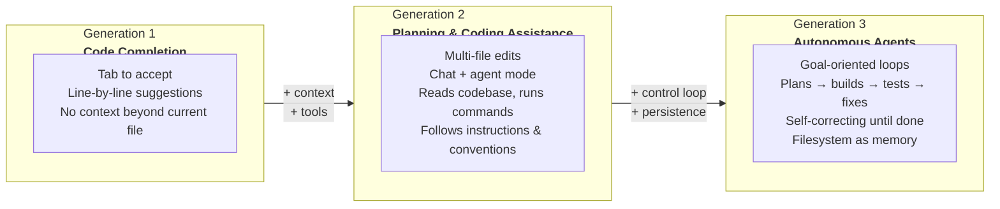

## Almost agentic coding in VS Code

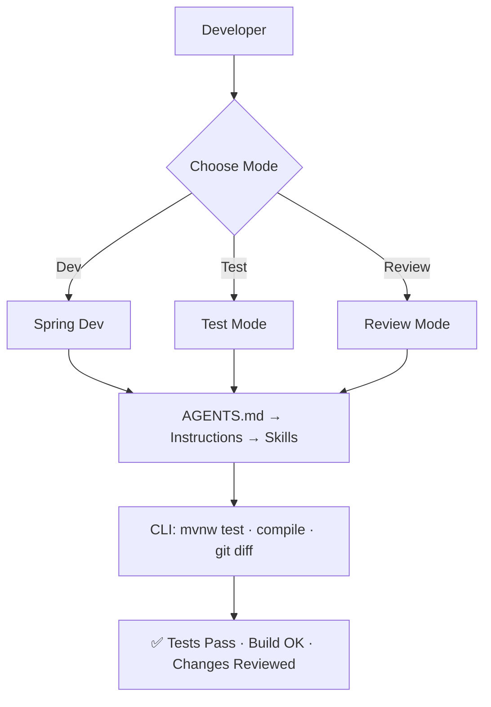

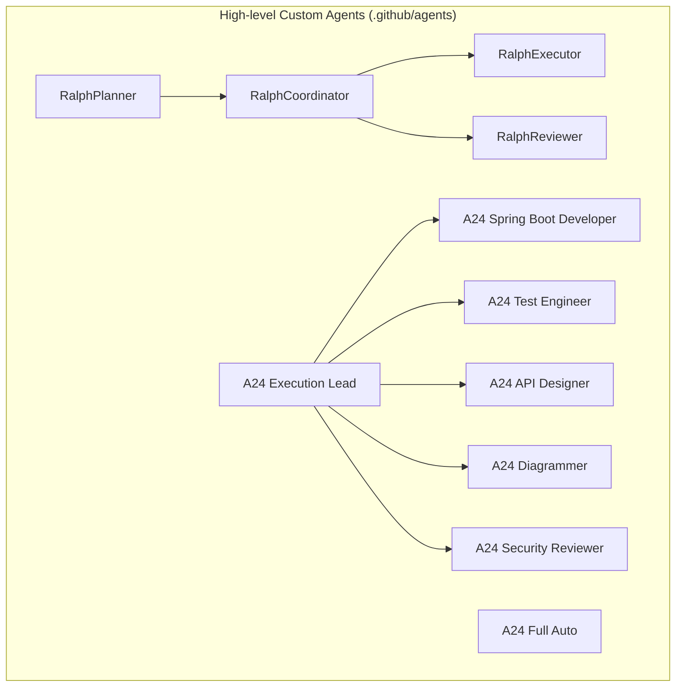
| **Context** | Current file | Codebase + instructions | PRD + progress files + git |
| **Control** | Human drives everything | Human guides, AI executes | AI loops until done |
| **Example** | Copilot completions | Copilot Agent Mode | CLI Ralph Loop (bash + AI) |

> **VS Code Copilot Agent Mode sits between Gen 2 and Gen 3.** It can plan, edit multiple files, run terminal commands, and self-correct — but it lacks a hard external control loop. The AI is both the worker _and_ the loop controller, which makes full autonomy probabilistic rather than guaranteed.
>
> This project pushes VS Code as close to Gen 3 as possible using custom agents, file-based state, and the handoff protocol described below.

---

## 📊 Architecture Overview

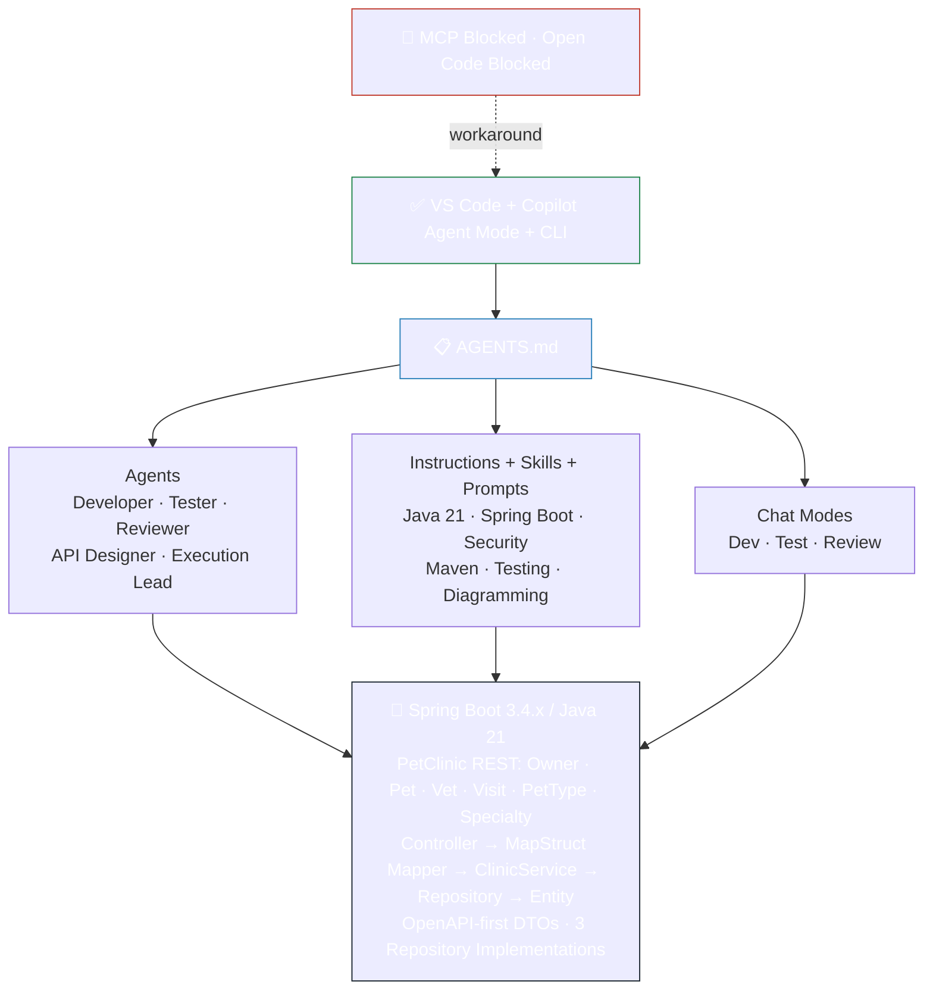

## 🔧 How Agentic Development Works (Without MCP)

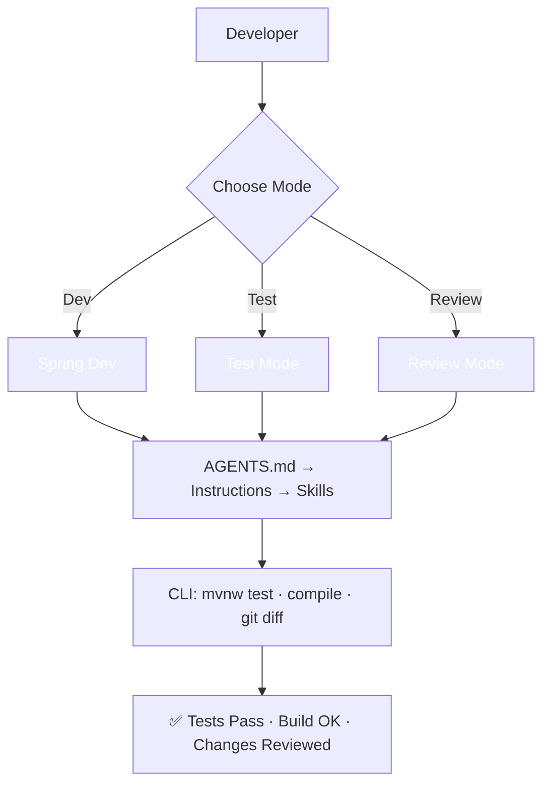

## 📁 Project Structure

<details>
<summary>Click to expand full project tree</summary>

```
.
├── AGENTS.md                          # 🤖 Main agent instructions (read by ALL agents)
├── PRD.md / PROGRESS.md               # 📋 Ralph Loop state files
├── pom.xml                            # 📦 Maven build configuration
│
├── .vscode/
│   ├── settings.json                  # ⚙️ Workspace settings (Copilot, Java, terminal tools)
│   └── extensions.json                # 📋 Recommended VS Code extensions
│
├── .github/
│   ├── copilot-instructions.md        # 📋 Project-wide Copilot instructions
│   ├── agents/                        # 🤖 Custom agents (Ralph Loop + specialists)
│   ├── instructions/                  # 📝 Context-specific coding rules
│   ├── prompts/                       # ⚡ Reusable prompt templates
│   ├── chatmodes/                     # 🎭 Custom chat modes (dev/test/review)
│   └── skills/                        # 🛠️ Domain knowledge for agents
│
├── docs/diagrams/                     # 📊 Generated Mermaid diagrams (SVG + source)
│
└── src/
    ├── main/java/.../petclinic/
    │   ├── model/                     # JPA entities (BaseEntity hierarchy)
    │   ├── mapper/                    # MapStruct mappers (entity ↔ DTO)
    │   ├── repository/                # 3 implementations: JDBC, JPA, Spring Data
    │   ├── service/                   # ClinicService facade
    │   ├── rest/controller/           # REST controllers (implement generated APIs)
    │   └── security/                  # Spring Security config
    ├── main/resources/
    │   ├── openapi.yml                # OpenAPI spec → generated DTOs + API interfaces
    │   └── application.properties     # Port 9966, context /petclinic/
    └── test/                          # JUnit 5 + Mockito + MockMvc tests
```

</details>

## 🚀 Quick Start

### Prerequisites
- Java 21 (LTS)
- VS Code with GitHub Copilot extension
- Git

### Setup
```bash
# Clone the project
git clone <repo-url>
cd agentic-spring-boot-starter

# Build and test
./mvnw clean test

# Run the application
./mvnw spring-boot:run

# Test the API (port 9966, context path /api/)
curl http://localhost:9966/api/owners
curl http://localhost:9966/api/pets
curl http://localhost:9966/api/vets
curl http://localhost:9966/api/visits
curl http://localhost:9966/api/pettypes
curl http://localhost:9966/api/specialties
```

### Using Copilot Agent Mode
1. Open the project in VS Code
2. Open Copilot Chat (Ctrl+Shift+I)
3. Switch to **Agent Mode** in the chat dropdown
4. Choose a chat mode:
   - **Spring Dev** — general development
   - **Test Mode** — focused testing
   - **Review Mode** — read-only code review
   - **Full Auto** — maximum autonomy for feature implementation
5. Use slash commands from the prompts: `/implement-feature`, `/new-rest-endpoint`, `/write-tests`, `/security-review`

### OpenAPI-First Architecture

This project follows an **OpenAPI-first** workflow:
- DTOs are generated from `src/main/resources/openapi.yml`
- **MapStruct** mappers handle entity-to-DTO conversion (no manual mapping code)
- The repository layer supports 3 interchangeable implementations: JDBC, JPA, and Spring Data JPA (selected via Spring profiles)

### Implementing a Feature Autonomously
The killer use case — give the agent a feature spec, it builds everything:

1. Switch to **Full Auto** chat mode
2. Use the `/implement-feature` prompt
3. Describe your feature using the OpenAPI-first workflow:
   ```
   /implement-feature

   Add a "MedicalRecord" feature for pets with these fields:
   - pet (required, reference to existing Pet)
   - recordDate (required, date)
   - diagnosis (required, max 255 chars)
   - treatment (optional, max 500 chars)

   Follow the OpenAPI-first workflow:
   1. Define the DTO schema in openapi.yml
   2. Create the JPA entity extending BaseEntity
   3. Create the MapStruct mapper
   4. Add methods to ClinicService
   5. Create the REST controller
   6. Include CRUD with search by pet.
   ```
4. The agent will autonomously:
   - Update openapi.yml with new DTO schemas
   - Create Entity extending the proper base class
   - Create MapStruct mapper for entity/DTO conversion
   - Add service methods to ClinicService
   - Create REST controller
   - Write unit + integration tests
   - Run `./mvnw test` to verify
   - Report what it built

## 🛡️ FSI Compliance Features

| Feature | Implementation |
|---------|---------------|
| No hardcoded secrets | Environment variables via `${VAR}` in application.yml |
| Input validation | Bean Validation (`@Valid`, `@NotBlank`, `@Size`) |
| Safe error responses | `@ControllerAdvice` — no stack traces exposed |
| Audit logging | SLF4J structured logging |
| Dependency security | Maven dependency tree analysis |
| Code review | Security Reviewer agent + review chatmode |

## 🔄 The Agentic Workflow

<details>
<summary>Sequence diagram — how developer, Copilot, and CLI interact</summary>

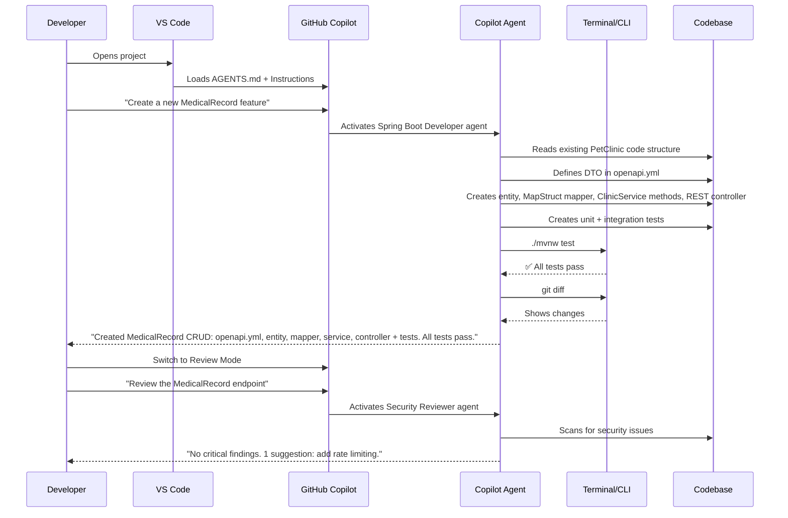

</details>

## 📖 VS Code Settings & Autonomy Configuration

<details>
<summary>Key settings that enable autonomous agent behavior</summary>

| Setting | Value | What It Does |
|---------|-------|-------------|
| `chat.agent.enabled` | `true` | Enables Agent Mode |
| `chat.tools.edits.autoApprove` | `true` | Agent creates/edits files without dialog |
| `chat.agent.autoFix` | `true` | Agent self-corrects compilation errors |
| `chat.agent.runTasks` | `true` | Agent runs VS Code build tasks |
| `chat.agent.maxRequests` | `50` | Allows complex multi-step implementations |
| `chat.tools.terminal.allowlist` | (regex) | Auto-approves `./mvnw`, `git`, `curl` |
| `chat.tools.terminal.denylist` | (patterns) | Blocks dangerous commands |
| `chat.tools.autoApprove` | `false` | ⚠️ Keep false for FSI safety |

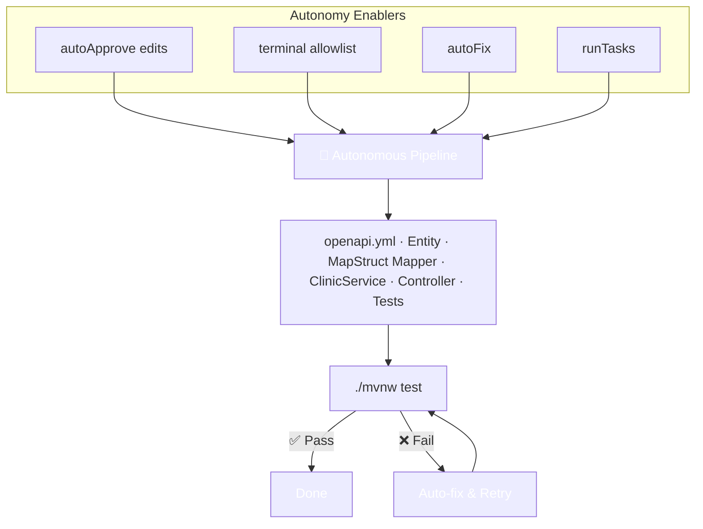

The `implement-feature` prompt + `feature-pipeline` instruction teach the agent to follow an OpenAPI-first pipeline. The agent learns by reading your existing code patterns (e.g., `Owner` for complex entities, `PetType` for simple ones).

</details>

## 📊 Orchestration, Diagramming & Quality Gates

<details>
<summary>Five capabilities adapted from <a href="https://github.com/petender/tdd-azd-demo-builder">petender/tdd-azd-demo-builder</a> for Spring Boot / Java 21</summary>

### 1. Diagrammer Agent — Architecture & ERD Diagrams

Scans source code, generates Mermaid diagrams, renders to SVG:
```
@diagrammer Generate an architecture diagram for this project
/generate-erd
```

### 2. Research-First Instruction

Auto-injected into ALL agents. Forces research (read existing code, conventions) before any implementation. No action needed.

### 3. Execution Lead — Feature Pipeline

Orchestrates specialized agents in sequence: Requirements → API Design → Implement → Test → Security Review → Diagram.
```
@execution-lead Create a "Visit" feature with fields: pet, visitDate, description, vet
```

### 4. JPA ERD Generator

Scans `@Entity` classes → extracts `@Id`, `@ManyToOne`, `@OneToMany`, `@ManyToMany` → generates professional ERD.

### 5. Quality Gates

Auto-enforced on all `.java` files: tests must pass (min 3 per class), zero compilation errors, no hardcoded secrets, `@Valid` on request bodies, conventional commit messages. Agents cannot report success if a gate fails.

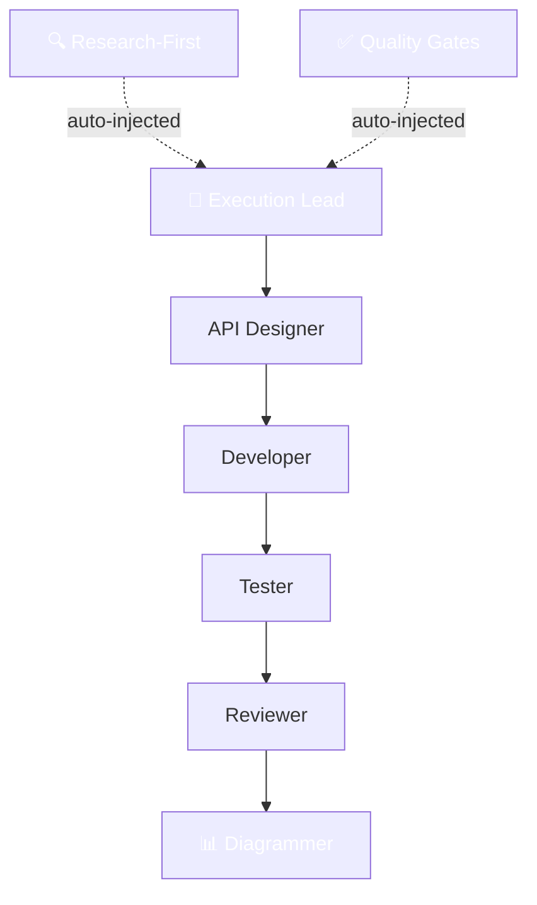

</details>

## 📋 Prompts & Skills Reference

<details>
<summary>Prompt files — reusable task templates invoked via <code>/</code> command</summary>

| Prompt | Description |
|--------|-------------|
| `/add-entity` | Scaffold a JPA entity + repository + validation |
| `/implement-feature` | Full pipeline: entity → DTO → mapper → service → controller → tests |
| `/write-tests` | Comprehensive JUnit 5 tests for an existing class |
| `/refactor-service` | Improve a service class for design and testability |
| `/security-review` | OWASP + FSI security audit |
| `/generate-erd` | Scan `@Entity` classes → Mermaid → SVG ERD |
| `/generate-architecture-diagram` | Scan code → Mermaid → SVG architecture diagram |

</details>

<details>
<summary>Skills — domain knowledge auto-loaded by agents</summary>

| Skill | Triggers |
|-------|----------|
| **api-development** | REST endpoints, validation, error handling, OpenAPI |
| **database-migration** | Schema changes, entity design, H2 console |
| **diagramming** | Architecture diagrams, ERD, Mermaid rendering |
| **maven-build** | Build errors, dependencies, packaging |
| **spring-testing** | JUnit 5, MockMvc, Mockito, TDD |
| **playwright-e2e** | Browser tests, API smoke tests, screenshots |

</details>

## 🔄 Ralph Loop — Autonomous Development Cycle

The Ralph Loop is an autonomous coding pattern (inspired by [giocaizzi/ralph-copilot](https://github.com/giocaizzi/ralph-copilot) and [Geoffrey Huntley's Ralph Wiggum pattern](https://ghuntley.com/ralph/)) where agents plan, execute, review, and commit tasks one at a time — using the **filesystem as memory** instead of conversation history.

---

### The Ideal: A True Control Loop

In a CLI-based Ralph Loop (e.g., bash + Claude Code), a **hard outer loop** guarantees continuation:

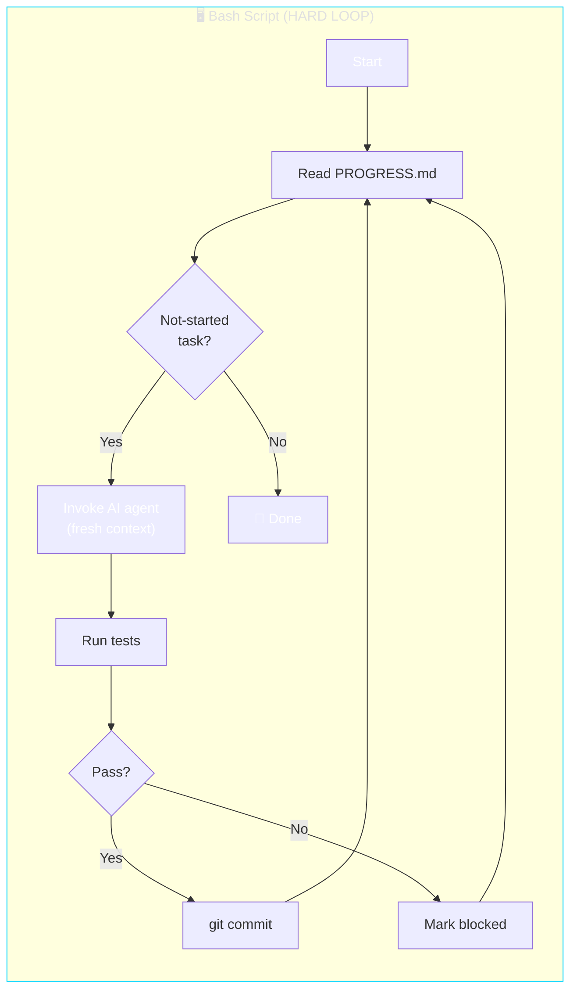

The bash script is the **control plane** — it can't be distracted, forget, or lose context. It mechanically reads a file, invokes an agent, checks results, and loops. The AI is just a tool called inside the loop.

---

### The VS Code Reality: No Hard Loop

In VS Code with Copilot agent mode, **there is no outer bash loop**. The AI itself _is_ the loop. This is a fundamentally different architecture:

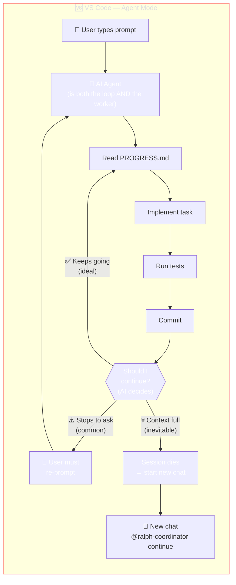

> **Key insight**: The AI is both the control plane _and_ the worker. There's nothing external forcing it to continue. It may stop, get confused, or run out of context — and there's no mechanism to restart it automatically.

---

### Why It Might Not Work (Theory)

The fundamental problem is **who controls the loop**:

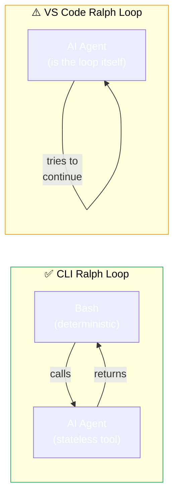

| Property | CLI Ralph Loop | VS Code Ralph Loop |
|----------|---------------|-------------------|
| **Control plane** | Bash script (deterministic) | AI itself (probabilistic) |
| **Loop guarantee** | ✅ Mechanical — always continues | ⚠️ Depends on model following instructions |
| **Context reset** | ✅ Fresh process each iteration | ❌ Same session — context accumulates |
| **Failure recovery** | ✅ Script catches exit codes | ⚠️ AI must self-diagnose |
| **Max iterations** | ∞ (until disk/quota runs out) | ~5-15 tasks before context window fills |
| **Resumability** | ✅ Just re-run the script | 🔄 Manual: open new chat, re-invoke agent |

**Three failure modes specific to VS Code:**

1. **The Polite Stop** — The model says _"Task 3 is done! Shall I continue?"_ instead of just continuing. Mitigated by strong instructions ("Never ask — just continue") but not guaranteed.

2. **Context Window Exhaustion** — After 5-15 tasks (depending on complexity), the conversation fills up. The model starts forgetting earlier tasks, hallucinating, or the session simply ends. There is **no workaround** — you must start a new chat.

3. **Model Drift** — Without a hard context reset, the model accumulates stale assumptions from earlier tasks. Task 8's code may be influenced by debugging output from Task 3. CLI loops avoid this by spawning a fresh process each time.

---

### Our Mitigation: The Handoff Protocol

Since we can't build a hard loop, we optimize for the **best realistic workflow** — a combination of self-continuation (works ~70% of the time) and easy manual recovery (for the other 30%):

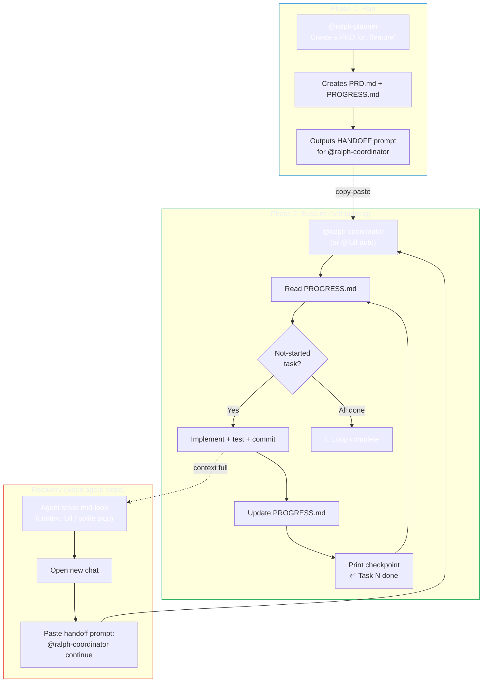

Every agent ends its response with a **HANDOFF block** — a ready-to-paste prompt for the next agent. This means:
- If the agent self-continues → great, the handoff is just informational
- If the agent stops → you copy-paste the handoff into a new chat to resume
- If context is exhausted → new chat + paste = the loop continues from where it left off

PROGRESS.md is the **single source of truth**. Any agent, in any session, reads it to know what's done and what's next.

---

### The Four Agents

| Agent | What It Does | Self-Loops? |
|-------|-------------|-------------|
| **`@ralph-planner`** | Decomposes feature → `PRD.md` + `PROGRESS.md` | No — runs once, outputs handoff |
| **`@ralph-coordinator`** | Reads PRD, implements tasks inline, tests, commits, loops | **Yes** — continues until all done |
| **`@ralph-executor`** | Implements exactly ONE task, commits, outputs handoff | No — single task, then hands off |
| **`@ralph-reviewer`** | Reviews changes (read-only), outputs PASS/FAIL + handoff | No — review only |

---

### Three Ways to Run

#### Mode 1: Full Auto (maximum autonomy)

Best for: well-defined features, confidence in the model.

```
@full-auto Add an Appointment entity with date, vet, pet, and notes fields.
Include CRUD REST API, MapStruct mapper, and full test coverage.
```

The agent plans, codes, tests, reviews, commits — all inline. No user interaction needed (until context fills up).

#### Mode 2: Coordinator Loop (balanced)

Best for: when you already have a reviewed PRD.

```
# Step 1: Plan (review the PRD before proceeding)
@ralph-planner Create a PRD for: [feature description]

# Step 2: Review PRD.md, edit if needed, then:
@ralph-coordinator Read PRD.md and PROGRESS.md. Start the loop.
```

#### Mode 3: Manual Chain (maximum control)

Best for: complex features, learning, or when models struggle with self-continuation.

```
# 1. Plan
@ralph-planner Create a PRD for: [feature]

# 2. Execute one task at a time
@ralph-executor Execute Task 1 from PRD.md: [description]

# 3. Review
@ralph-reviewer Review Task 1. Changed files: [list]

# 4. Continue (paste the handoff prompt from the reviewer)
@ralph-executor Execute Task 2 from PRD.md: [description]

# ... repeat until done
```

---

### Practical Tips

| Tip | Why |
|-----|-----|
| **Keep tasks small** (max 2-3 files each) | Smaller tasks = less context per iteration = more tasks before context fills |
| **Start a new chat every 5-7 tasks** | Proactive context reset — don't wait for degradation |
| **Use `@full-auto` for simple features** | Entity + CRUD + tests is well within one session |
| **Use `@ralph-coordinator` for complex features** | More structure, easier to resume if interrupted |
| **Always check `PROGRESS.md` after interruption** | It's the source of truth — tells any new session exactly where to pick up |
| **Prefer GPT-4.1 / Sonnet for the loop** | They follow "keep going" instructions more reliably than smaller models |

---

### Further Reading

- [giocaizzi/ralph-copilot](https://github.com/giocaizzi/ralph-copilot) — Original Ralph Loop blueprint for Copilot
- [Geoffrey Huntley's Ralph Wiggum pattern](https://ghuntley.com/ralph/) — The origin story
- [Ralph Wiggum Cross-Platform Guide](https://ai-checker.webcoda.com.au/articles/ralph-wiggum-cross-platform-cursor-copilot-2026) — Bash scripts for multiple AI agents
- [Chaining Copilot Custom Agents](https://www.ericksegaar.com/2025/12/15/chaining-github-copilot-custom-agents-automating-your-dev-cycle/) — Agent orchestration patterns
- [From ReAct to Ralph Loop](https://www.alibabacloud.com/blog/from-react-to-ralph-loop-a-continuous-iteration-paradigm-for-ai-agents_602799) — Academic perspective on continuous agent iteration

## 🤖 Agents Reference

| Agent | Purpose | Mode |
|-------|---------|------|
| **A24 Spring Boot Developer** | Builds REST APIs, services, data access layers | Read/write |
| **A24 Test Engineer** | JUnit 5, Mockito, Spring Boot testing | Read/write |
| **A24 API Designer** | REST API design, HTTP semantics, OpenAPI | Advisory |
| **A24 Security Reviewer** | OWASP/FSI security review | Read-only |
| **A24 Code Review** | Quality, security, best practices review | Read-only |
| **A24 Diagrammer** | Mermaid architecture + ERD diagrams | Read/write |
| **A24 Execution Lead** | Orchestrates full feature pipeline via sub-agents | Orchestration |
| **A24 Full Auto** | Plans + implements + tests + commits in one self-looping session | Self-looping |
| **RalphPlanner** | Creates PRD with atomic tasks, outputs handoff prompt | Planning |
| **RalphCoordinator** | Self-looping: implements all tasks inline from PRD | Self-looping |
| **RalphExecutor** | Implements one task, commits, outputs handoff for next step | Read/write |
| **RalphReviewer** | Reviews changes — PASS/FAIL, outputs handoff prompt | Read-only |

---

## 📝 Example Task: Excel Import / Export

> A realistic feature spec to test the Ralph Loop with. Try: `@ralph-planner Create a PRD for the Excel Import/Export feature below`

### Goal
Add Excel export and import to the PetClinic web app so users can bulk-edit Owner records in a spreadsheet and re-import them.

### Requirements

- **Export**: Download all Owners as an `.xlsx` file from the web UI (one click)
- **Import**: Upload a modified `.xlsx` file to update/create Owner records
- **Conflict resolution UI**: If the import encounters problems, show an interactive resolution page:
  - Invalid data → highlight the cell with a clear error message (e.g., "Telephone must be digits only")
  - Duplicate records → show side-by-side comparison (existing vs. imported) with merge/skip/overwrite options
  - Missing required fields → indicate which fields are missing with inline hints
- **Auto-fix heuristics**: Before showing errors to the user, try to fix common issues automatically:
  - Trim whitespace from all string fields
  - Normalize phone numbers (strip dashes, spaces, parentheses)
  - Title-case first/last names
  - Skip completely empty rows silently
  - If city is missing but address contains a known city name, auto-fill it
- **Transactional**: Import either fully commits or fully rolls back — no partial state
- **Security**: Require `OWNER_ADMIN` role for both import and export
- **API**: REST endpoint `POST /api/owners/import` accepting `multipart/form-data` (defined in OpenAPI spec)
- **Tests**: Unit tests for parsing/validation, MockMvc tests for the endpoint, Playwright e2e test for the full flow

### How to Run This with the Ralph Loop

```bash
# Mode 1: Full Auto — one prompt, hands-free
@full-auto Implement the Excel Import/Export feature from the README example task section.

# Mode 2: Plan first, then execute
@ralph-planner Create a PRD from the Excel Import/Export requirements in README.md
# ... review PRD.md ...
@ralph-coordinator Start the loop.
```

---

## 🤝 Contributing

This is a starter template. Customize it for your team:

1. **Modify `AGENTS.md`** to match your project's conventions
2. **Add instructions** for your specific frameworks and libraries
3. **Create prompts** for your team's common tasks
4. **Define agents** for your team's roles
5. **Tune the terminal allowlist** for your build tools

## 📚 Further Reading

- [GitHub Blog: How to write a great AGENTS.md](https://github.blog/ai-and-ml/github-copilot/how-to-write-a-great-agents-md-lessons-from-over-2500-repositories/)
- [VS Code: Custom Agents](https://code.visualstudio.com/docs/copilot/customization/custom-agents)
- [VS Code: Custom Instructions](https://code.visualstudio.com/docs/copilot/customization/custom-instructions)
- [VS Code: Prompt Files](https://code.visualstudio.com/docs/copilot/customization/prompt-files)
- [Agentic DevOps Safe Mode for Secure Copilot Agents](https://arinco.com.au/blog/agentic-devops-safe-mode-a-practical-framework-for-secure-github-copilot-agents/)
- [FSI Agent Governance Framework](https://judeper.github.io/FSI-AgentGov/playbooks/control-implementations/1.1/portal-walkthrough/)

## 📄 License

Internal use — Swiss Re / FSI environments.
